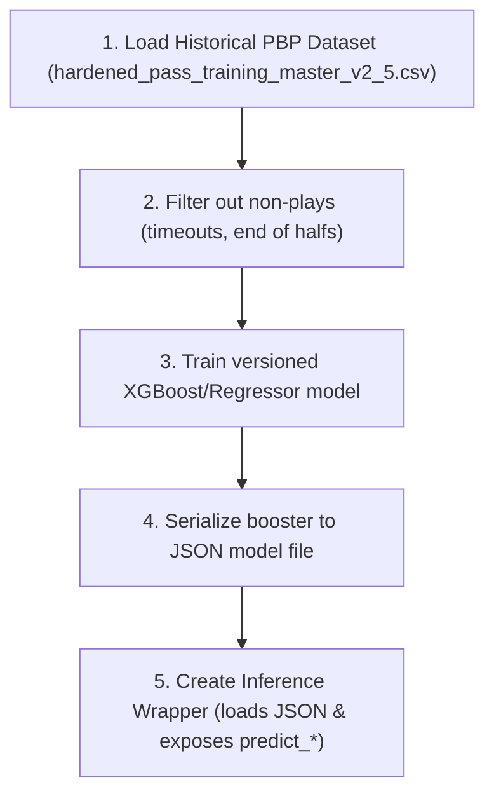
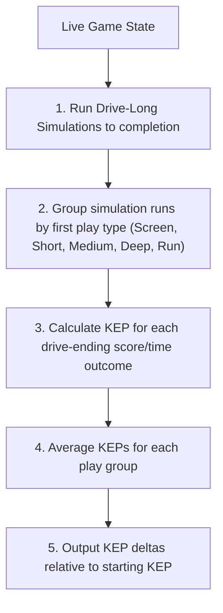

# NFLSims Project: Development & Modeling Workflows (WORKFLOW.md)

This document outlines the standard workflows for model development, drive simulation rollouts, API integration, and validation within the `NFLSims` project.

---

## 📈 1. Model Development & Training Workflow

When creating or updating predictive models (such as `positional_ep`), follow this step-by-step process:

### Key Rules:
- **Version Control:** Save all modeling scripts under `src/nfl_sim/models/<model_name>_v_<version>/`.
- **Training Documentation:** Every model directory must contain its own documentation/specification detailing features, training parameters, and validation logs.

---

## 📡 2. Drive Simulation Rollout Workflow

To evaluate the mathematical point advantage of the first play in a series, the evaluator follows this simulation flow:

### Rollout Parameters:
- **Sample Size:** Run a minimum of $10,000$ iterations to ensure stable play classification distributions.
- **Stop Condition:** Simulations must terminate at change of possession (touchdown, field goal, punt, turnover, or end of half).
- **Matchup DNA:** The first play execution retains roster-specific DNA (if available) to capture realistic matchup dynamics, while subsequent plays use the standard impartial playbook policies.

---

## 🧪 3. Verification & Deployment Workflow

### 3.1 Automated Testing
- For every new positional model or evaluator component, write a corresponding unit test in the `tests/` directory (e.g., `tests/test_positional_evaluator.py`).
- Assert boundaries:
  - EP increases monotonically as yardline approaches the goal line.
  - Kickoff Equivalent Points (KEP) scales correctly with time.
  - Impartial states evaluate identically regardless of input team name parameters.

### 3.2 Endpoint Auditing
- Verify that the FastAPI backend API serves the endpoints correctly by running a local curl/fetch check.
- Endpoint contract validations:
  - `/api/positional-evaluator` must return valid float values for `ep` and `kep`.
  - `/api/games/{game_id}/positional-eval` must return a sequential JSON list of play evaluations.

### 3.3 Frontend Validation
- Run the frontend applications locally (`npm run dev`) and test the UI elements.
- Verify that dragging the situation sliders in the "In Development" preview page instantly recalculates the point evaluations and play recommendations.
