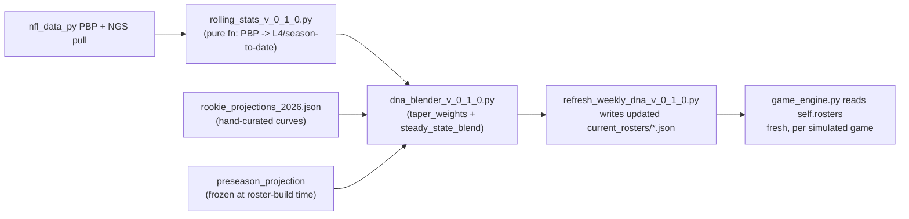

# DEVELOPMENT.md — NFLSims Workspace Map

<!-- Human + AI onboarding doc. Updated: 2026-09-22 (fixed the boxscores
tracking claim below; see AGENTS.md for what else changed this pass). For the token-dense
AI-to-AI handoff contract (active bugs, fragile areas, exact test commands),
see AGENTS.md — this file is the architecture/setup map, that one is the
"what's currently on fire" ledger. Read both. -->

## 1. What This Project Is

An NFL Monte Carlo game simulation engine (`src/nfl_sim/`) plus two React frontends (a DFS/lineup-optimizer site and an analytics/strategy site) and a live-game 4th-down decision bot (R, posts to Twitter/X/Mastodon/Bluesky). The engine vectorizes N simulated games in parallel (numpy arrays, not a loop per game) and drives every in-game decision (play selection, sacks, completions, YAC, rush yards, 4th-down, kicking) off a set of trained XGBoost models plus a per-player/per-team "DNA" data layer (`data/dna/`, `data/current_rosters/`).

## 2. Active Code Areas

```
src/nfl_sim/game_engine.py        ACTIVE, most-changed file. Vectorized Monte Carlo engine.
src/nfl_sim/model_registry.py     ACTIVE. Singleton loading all trained models once per process.
src/nfl_sim/batch.py              ACTIVE. BatchSimulator: wraps the engine for N-iteration batch runs.
src/nfl_sim/proe_overlay_v_0_1_0.py  ACTIVE. Coach PROE (pass-rate-over-expected) logit-space adjustment.
src/nfl_sim/nfl_positional_evaluator.py  ACTIVE. Chess-style KEP/EP positional evaluator.
src/nfl_sim/models/                ACTIVE. 11 trained model families (XGBoost joblib/native-json artifacts + their training scripts). Git-tracked as of the 2026-07-15 audit.
src/data_pipeline/                 ACTIVE (new 2026-07-22). Pure-function DNA blending engine — see §5.
src/api/app.py                     ACTIVE. FastAPI backend, port 8000.
src/live/                          ACTIVE. ESPN scraper + live 4th-down posting policy — a DIFFERENT concept-space than the sim engine (real dynamic possession, not away/home), see AGENTS.md §8.
scripts/roster_management/         ACTIVE (new 2026-07-22). Builds/refreshes every DNA and roster file the engine reads — see §5.
scripts/eda/                       ACTIVE. Real-PBP EDA scripts backing every calibration constant in the engine. Read before touching a magic number in game_engine.py — check if EDA already justifies it.
scripts/simulation_runners/        ACTIVE. Batch audit drivers (the way to measure any engine change at scale) + full-season dataset generators.
R/ (root)                          ACTIVE, not deprecated. Live 4th-down bot — see AGENTS.md §2, do not treat as legacy.
frontend/                          ACTIVE. DFS site, port 5173 (API on 8002).
frontend_analysis/                 ACTIVE. Analytics/strategy site, port 5174 (API on 8000).
tests/                             ACTIVE. pytest suite — see §4.

legacy/                            LEGACY, mostly archival — but src/nfl_sim/batch.py actively imports legacy.game_engine_sequential as its non-vectorized fallback, so it's not purely dead. See AGENTS.md §2.
scripts/play_by_play_runner.py     LEGACY — drives the old sequential engine, interactive. Use scripts/print_play_by_play_v020.py instead.
venv_py38_old/                     LEGACY — retired Python 3.8 environment, kept until 3.12 is fully trusted, not yet deleted.
```

Full per-file detail, current bugs, and fragile areas: [AGENTS.md](AGENTS.md).

## 3. Local Setup

### Python (engine, API, data pipeline)

```bash
# Requires Python 3.12 (pinned; the repo was upgraded off 3.8 on 2026-07-15)
python -m venv venv
venv\Scripts\activate          # Windows
pip install -r requirements.txt
```

**Critical gotcha (confirmed 2026-07-22, cost real debugging time before being found):** a bare `python`/`python3` on PATH can silently resolve to an unrelated system Python instead of this repo's `venv/` — the symptom is `ModuleNotFoundError: No module named 'numpy._core'` when `ModelRegistry()` loads a trained model, which looks like a real numpy/joblib version mismatch but isn't. Always activate `venv/`, or invoke `venv\Scripts\python.exe` directly, before running anything that touches `ModelRegistry`, trained models, or `import src.nfl_sim`. See [AGENTS.md](AGENTS.md) §8.

### R (live 4th-down bot only)

The `R/` directory at repo root is the live game-day bot — a separate runtime from the Python engine. Needs R + the packages `run_one_sim.R` and the bot scripts `library()` (no `renv.lock` committed; install what each script's `library()` calls list). Not needed to work on the sim engine itself.

### Frontends

```bash
cd frontend && npm install            # DFS site (React 19 + Vite)
cd frontend_analysis && npm install   # Analytics site (React 19 + Vite + Recharts)
```

## 4. Run Commands

```bash
# Analytics API (port 8000) — backs frontend_analysis
python -m uvicorn src.api.app:app --host 0.0.0.0 --port 8000

# DFS API (port 8002) — backs frontend
.\start_backend_api.bat

# Frontends (each proxies /api to its backend via vite config — never hardcode localhost)
cd frontend_analysis && npm run dev    # :5174
cd frontend && npm run dev             # :5173

# Full test suite
python -m pytest tests/ -v

# 2026 DNA blending pipeline tests (pure functions, no I/O — fast)
python -m pytest tests/test_dna_blender.py -v

# Full batch audit — THE way to measure any game_engine.py change at scale
# (64 games x 1000 iterations). Takes several minutes.
python scripts/simulation_runners/run_weeks_1_to_4_2025.py

# Weekly DNA refresh (run by hand after each week's real games — NOT scheduled)
python scripts/roster_management/refresh_weekly_dna_v_0_1_0.py <year> <completed_week>
```

Exact verification sequence for any `game_engine.py` change, and the full EDA/audit script inventory: [AGENTS.md](AGENTS.md) §7.

## 5. Data Flow — DNA, Rosters, and the Weekly Blend (built 2026-07-22)

This is the layer that feeds every model in the engine. Two kinds of files:

- **`data/dna/{qb,rb,wr,te,skill,coach}_dna.json`** — multi-season *career-average* priors. Rebuilt from `nfl_data_py` PBP/NGS pulls. **Gitignored** (large, mechanically regeneratable) — see §6.
- **`data/dna/trench_dna.json`** — team-level, season-keyed (not gitignored — see §6 for why).
- **`data/current_rosters/{TEAM}_traits_{year}.json`** — the *live, per-week* snapshot the engine actually samples from for `target_share`/`carry_share`/`scramble_rate`/most efficiency fields. This is what changes week to week during a season.

**The blend, in one paragraph:** every player starts the season at a hand-set/DNA-derived `preseason_projection` (100% weight). Each completed game tapers that weight down (100/80/60/40/20% before games 1-5), replaced by real rolling last-4-games and season-to-date data — by game 6, it's a pure `(2/3)*L4 + (1/3)*season_to_date`, zero projection weight. Rookies get a separate parametric usage/efficiency curve instead of one static number, since usage is coach-gated. The same formula applies to team defense (`trench_dna.json`).

**Start-of-2026-season roster/injury layer (2026-09-02, roster source moved to nfl.com 2026-09-03):** the 2026 hand-tune surface is **32 per-team Excel-editable sheets** in `data/overrides/2026/season_long/{TEAM}.csv` (which **replace** `data/dna/preseason_overrides_2026.csv` + `zone_usage_overrides_2026.csv` as the thing you edit — 26 cols: identity + `roster_slot`/`return_week`/`note` + 15 flat tunable fields + `rz_*`/`gl_*` red-zone/goal-line shares) + `week_NN/{TEAM}.csv` for per-week injury adjustments. Scripts (`scripts/roster_management/`): `scrape_nfl_rosters_v_0_1_0.py` caches the 32 nfl.com roster pages → `_nfl_com_roster.csv` (the roster-status source); `export_team_season_overrides_v_0_1_0.py` seeds the season sheets; `build_week_overrides_v_0_1_0.py <week>` redistributes injured players' shares; `apply_team_season_overrides_v_0_1_0.py` folds the sheets back into the two league-wide CSVs → traits JSON via the existing `apply_preseason_overrides` + `apply_zone_usage_overrides`; `build_roster_md_v_0_1_0.py` writes `docs/rosters/2026/{TEAM}.md`. Per-week logic: [`src/data_pipeline/week_roster_v_0_1_0.py`](src/data_pipeline/week_roster_v_0_1_0.py) (`resolve_week_rows`). Full workflow + review-flag guide: [`data/overrides/2026/README.md`](data/overrides/2026/README.md). Not yet wired into a season-sim driver.

**Where that starting `preseason_projection` actually comes from:** [`data/dna/preseason_overrides_2026.csv`](data/dna/preseason_overrides_2026.csv) — the hand-tuned starting point for every returning player's usage shares (`target_share`/`carry_share`) and efficiency fields (`adot`, `catch_rate`, `cpoe`, `sack_rate`, etc.), overriding the mechanically-rebuilt career-average baseline wherever Cam has real qualitative reasoning to move off it (injury recovery, scheme change, camp buzz, depth-chart calls). As of 2026-08-05 this covers all 32 teams. The reasoning behind every hand-edit — not just the number, but *why* — lives in the companion [`data/dna/preseason_overrides_2026_notes.md`](data/dna/preseason_overrides_2026_notes.md), organized by team; read it before assuming a CSV value is a typo. Known, accepted gaps as of 2026-08-05: several just-drafted/just-signed players aren't promoted into the flat CSV yet (still sitting in `rookie_projections_2026.json`'s curve form, or missing from either file entirely for a couple of very recent free-agent moves — see the notes doc's per-team sections for the current list), and red-zone/inside-the-5 usage-and-efficiency splits aren't modeled anywhere yet (season-long shares are used as a stand-in near the goal line too) — both deliberately deferred, not oversights.



**Build order** (only needed once per season, or if rebuilding from scratch): `build_full_name_dna.py` (career DNA) → R script (`coach_dna.json`) → `build_2026_rosters_v_0_1_0.py` (roster shell) → `build_2026_trench_shell_v_0_1_0.py` (team defense shell) → `build_rookie_projections_v_0_1_0.py` (rookie skeleton, hand-edit after) → hand-edit `preseason_overrides_2026.csv` (see above). Also run `merge_coach_proe.py` + `merge_2026_coach_placeholders.py` after any `coach_dna.json` rebuild (see §7 — a full rebuild silently drops what both of these patch back in). Weekly, in-season: `refresh_weekly_dna_v_0_1_0.py <year> <week>`.

**`game_engine.py` reads `self.rosters` fresh at construction, per game** — there's no live mutation mid-game. The weekly refresh runs *between* games (by hand, not scheduled), updates the JSON files on disk, and the next simulated game picks up whatever's there. All model-consumed fields (not just usage) source from `self.rosters` as of 2026-07-22's Phase 7 rewiring — see AGENTS.md §11.14.

Full phase-by-phase build history: [WORKLOG.md](WORKLOG.md)'s 2026-07-22 entry (Phases 0-7) and 2026-08-05 entry (preseason overrides complete for all 32 teams; `coach_dna.json`'s 2026-HC gap closed).

## 6. Generated Files & Model/Data Artifacts

**Gitignored, regenerate via `scripts/roster_management/regenerate_dna_v_0_1_0.py`:** `data/dna/qb_dna.json`, `rb_dna.json`, `wr_dna.json`, `te_dna.json`, `skill_dna.json`, `coach_dna.json`, `data/current_rosters/*_traits_2026.json`. This is a **repo-size decision only** — the repo is public (site + 4th-down bot need it to stay that way), so gitignoring data doesn't hide the methodology; the code computing it is committed regardless.

**Tracked despite being data, on purpose:**
- `data/dna/trench_dna.json` — large, but its composite z-score fields (`run_block_off_z` etc.) depend on an EDA CSV chain (`docs/eda_outputs/*`) not itself confirmed fully regeneratable by a verified script. Regenerating it from scratch risks silently shipping without those fields.
- `data/dna/rookie_projections_2026.json`, `team_to_coach_{year}.json`, `trench_tiers_{year}.json` — small, and once hand-edited, carry real judgment calls a script can't reproduce.
- `data/dna/preseason_overrides_2026.csv` + `preseason_overrides_2026_notes.md` — the hand-tuned preseason starting point (see §5) and the qualitative reasoning behind it, for all 32 teams as of 2026-08-05. Pure judgment calls, not regeneratable by any script.

**Never hand-edit:** `src/nfl_sim/models/clock_pace_v_0_1_0/pace_pools.json` (rebuild via `scripts/eda/analyze_clock_pace_grid.py`), `docs/audit/v_0_2_0_audit/*.json` (regenerated by the audit scripts), `data/interim/*.parquet` (full-season sim cache, regenerated by `run_full_season_sim_2025.py`).

**Trained models** (`src/nfl_sim/models/*/`, joblib + xgboost-native json) are git-tracked, not gitignored — update only on a real retrain, and re-verify predictions haven't drifted (see AGENTS.md §0's `iteration_range` lesson for one real way this has silently broken before).

**`docs/boxscores/week_*/` IS git-tracked** (82 files as of the 2026-09 audit, Phase 6) — this doc previously claimed the opposite. Whether that's the right call (generated output vs. source) is an open question, not yet decided — see the audit's H3 doc-consolidation item.

## 7. AI Onboarding Notes

Read in this order:
1. **[README.md](README.md)** — roadmap, high-level goals.
2. **[AGENTS.md](AGENTS.md)** — the dense, current-priorities ledger. §0 is "what's active right now," §8 is "known gotchas," read both before touching `game_engine.py`.
3. **This file** — architecture/setup.
4. **[WORKLOG.md](WORKLOG.md)** — session-by-session history if you need to understand *why* something is the way it is, not just what it is.

**Before touching `game_engine.py`:** check AGENTS.md §8 (Fragile Areas) and §11 (the `clock_physics_v020` audit history) first — several plausible-sounding hypotheses have already been investigated and ruled out there; don't re-derive them from scratch.

**Before rebuilding any file under `data/dna/`:** confirm every field in the *current* file is actually reproduced by the script about to rebuild it — a one-time merge script's output (e.g. `coach_dna.json`'s `proe` field, or its 5 first-time-2026-HC alias/placeholder entries added 2026-08-05) can silently vanish on a full rebuild with no error, since a full rebuild only writes what the core builder script itself computes. Both are patched back in by dedicated merge scripts (`merge_coach_proe.py`, `merge_2026_coach_placeholders.py`) — rerun **both** after any full `coach_dna.json` rebuild, not just one. See AGENTS.md §8's 2026-07-22 entry for the concrete `proe` example.

**`coach_dna.json` entries aren't all equally real:** most are genuine multi-season nflfastR career aggregates, but a few carry an added `_note` field flagging them as either an alias (a different real coach's data reused as a clean proxy — e.g. Klint Kubiak aliased from Mike Macdonald's Seahawks-OC-tenure entry) or a league-average placeholder (for a first-time HC with no real personal HC-level play-calling data — e.g. Jesse Minter, Jeff Hafley, Joe Brady, Todd Monken as of 2026-08-05). Check for `_note` before treating any single coach's numbers as ground truth.

**Safety:** this project has no destructive external side effects from normal dev work (no payments, no production data mutation) except the live 4th-down bot's social posting (`R/bots/`) — do not run those against real credentials without explicit confirmation, and never commit `.env`/API keys.
