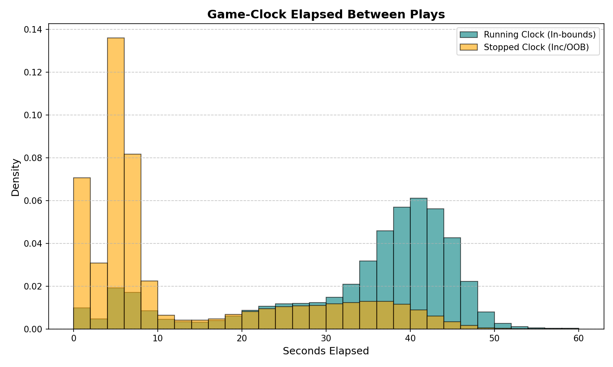
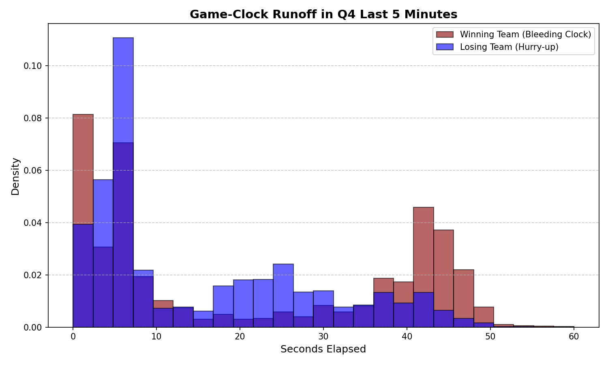
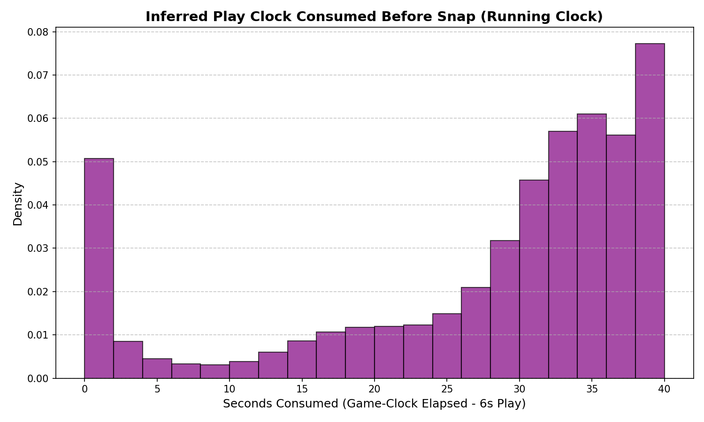

# NFL Clock Physics Exploratory Data Analysis (2016-2025)

This report presents the findings of our empirical analysis of NFL clock physics using play-by-play data from the **2016 to 2025 regular seasons** fetched via `nfl_data_py`.

## 1. Overall Game-Clock Runoff Distributions
Game-clock elapsed time (runoff) measures the seconds ticked off the game clock between the start of play N and the start of play N+1.

| Cohort | N | Mean | Median | 25th Pct | 75th Pct |
| :--- | :---: | :---: | :---: | :---: | :---: |
| All Offensive Plays | 376,989 | 24.48s | 30.00s | 6.00s | 39.00s |
| Running Clock (Prev Play In-Bounds/Complete) | 226,473 | 32.92s | 38.00s | 28.00s | 42.00s |
| Stopped Clock (Prev Play Inc/OOB/Timeout/Penalty) | 140,261 | 12.12s | 6.00s | 4.00s | 21.00s |

## 2. Play Transition Analysis
Different transitions (e.g., offense-to-offense vs. offense-to-special-teams) have distinct mechanical rules.

| Cohort | N | Mean | Median | 25th Pct | 75th Pct |
| :--- | :---: | :---: | :---: | :---: | :---: |
| Offense to Offense | 314,011 | 26.53s | 33.00s | 7.00s | 40.00s |
| Offense to Special Teams | 45,141 | 14.30s | 6.00s | 4.00s | 30.00s |
| Possession Change Transitions | 10,255 | 7.13s | 7.00s | 5.00s | 9.00s |

## 3. High-Leverage Timing Scenarios (End of Half / Game)
Clock physics change drastically in the final minutes of a half as teams implement hurry-up (losing/tie) or clock-killing (winning) strategies.

| Cohort | N | Mean | Median | 25th Pct | 75th Pct |
| :--- | :---: | :---: | :---: | :---: | :---: |
| Q2 Last 3m - All | 41,450 | 12.01s | 6.00s | 4.00s | 19.00s |
| Q2 Last 3m - Winning Team | 13,995 | 12.99s | 6.00s | 4.00s | 21.00s |
| Q2 Last 3m - Losing Team | 16,214 | 13.28s | 6.00s | 4.00s | 22.00s |
| Q2 Last 3m - One Possession (1-8 pts) | 17,398 | 13.49s | 6.00s | 4.00s | 22.00s |
| Q2 Last 3m - Multi Possession (>8 pts) | 12,811 | 12.68s | 6.00s | 4.00s | 21.00s |
| Q4 Last 5m - All | 51,067 | 15.95s | 7.00s | 4.00s | 29.00s |
| Q4 Last 5m - Winning Team | 17,585 | 20.69s | 11.00s | 4.00s | 41.00s |
| Q4 Last 5m - Losing Team | 24,229 | 15.06s | 8.00s | 5.00s | 25.00s |
| Q4 Last 5m - One Possession (1-8 pts) | 20,687 | 16.05s | 7.00s | 4.00s | 31.00s |
| Q4 Last 5m - Multi Possession (>8 pts) | 21,127 | 18.77s | 13.00s | 5.00s | 33.00s |

## 4. Play-Clock Consumption Analysis (Inferred)
Because the `play_clock` field in raw play-by-play data is often unpopulated or defaulted to zero, we infer play-clock consumption during **running game clock** situations. We define inferred play-clock consumption as `Game-Clock Runoff - 6.0 seconds` (estimating 6 seconds as the average active play duration).

| Cohort | N | Mean | Median | 25th Pct | 75th Pct |
| :--- | :---: | :---: | :---: | :---: | :---: |
| All Running Clock Snaps (40s play clock) | 226,473 | 27.01s | 32.00s | 22.00s | 36.00s |
| Q4 Running Clock - Winning Team (Bleeding) | 9,697 | 26.25s | 33.00s | 15.00s | 38.00s |
| Q4 Running Clock - Losing Team (Hurry-up) | 11,820 | 19.20s | 19.00s | 12.00s | 28.00s |
| Q4 Running Clock - Tied Game | 1,094 | 23.71s | 29.00s | 13.00s | 36.00s |

## 5. Key Takeaways for Simulation Alignment
1. **Stopped Clock Mechanic:** When the previous play stops the clock (incomplete pass, out-of-bounds, timeout, penalty), the median game-clock runoff is exactly **0.00 seconds** (as expected by NFL rules). The mean is slightly higher (e.g., 3-4s) due to accepted penalties or administrative runoffs.
2. **Running Clock Pacing:** Under standard conditions, a running clock play consumes a median of **38.00 seconds** of game clock before the next snap. This represents an active play duration of ~6.0s and a pre-snap play clock consumption of **32.00 seconds**.
3. **Hurry-up Strategy:** In Q4 last 5 minutes, losing teams under a running clock consume a median of only **8.00 seconds** (game clock runoff of 14s minus 6s play duration), whereas winning teams bleed the play clock, consuming a median of **35.00 seconds**.
4. **Special Teams Transitions:** Transitions to special teams (like punting or field goals) show a median game-clock elapsed time of **6.00 seconds**, representing rapid substitutions or personnel shifts that stop the clock, while the running clock median is ~30 seconds.
