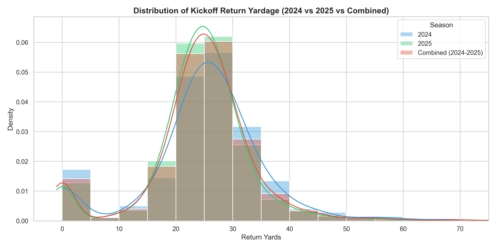
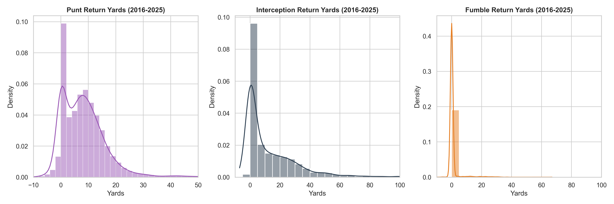

# 🏈 NFL Return Analytics & Historical EDA
    
This document provides a comprehensive Exploratory Data Analysis (EDA) of return yardage and scoring events across the NFL for **Kickoffs (2024-2025)** and **Punts, Interceptions, and Fumbles (2016-2025)**.

---

## 📈 1. Kickoff Returns Analysis (Dynamic Kickoff Era)

Following the major rule change in 2024, the kickoff dynamics shifted significantly. Below is a comparative breakdown of 2024, 2025, and combined metrics.

| Metric | 2024 | 2025 | Combined (2024-2025) |
| :--- | :---: | :---: | :---: |
| **Total Kickoffs** | 2,803 | 2,785 | 5,588 |
| **Touchback Rate** | 64.32% | 20.68% | 42.57% |
| **Fair Catch Rate** | 0.11% | 0.07% | 0.09% |
| **Return Rate** | 35.57% | 79.25% | 57.34% |
| **Avg Return Yards** | 25.42 yds | 24.41 yds | 24.72 yds |
| **Median Return Yards** | 26.0 yds | 25.0 yds | 25.0 yds |
| **Return Touchdowns** | 7 | 6 | 13 |
| **TD Rate (of all Kickoffs)** | 0.2497% | 0.2154% | 0.2326% |
| **TD Rate (of Returns)** | 0.70% | 0.27% | 0.41% |

### Kickoff Return Distribution Plot

---

## 🏈 2. Punts, Interceptions, and Fumbles (Last 10 Years: 2016-2025)

Here is the historical return data for non-kickoff plays over the last 10 seasons.

### Key Metrics Summary Table

| Metric | Punts | Interceptions | Fumbles (Lost) |
| :--- | :---: | :---: | :---: |
| **Total Plays** | 21,573 | 4,124 | 2,781 |
| **Touchback Rate / Fair Catch Rate** | FC: 27.42% / TB: 6.78% | N/A | N/A |
| **Return Rate** | 42.39% | 100% | 100% |
| **Avg Return Yards** | 8.88 yds | 12.74 yds | 0.80 yds |
| **Median Return Yards** | 7.0 yds | 5.0 yds | 0.0 yds |
| **Return Touchdowns** | 83 | 368 | 223 |
| **TD Rate (of total events)** | 0.3847% | 8.92% | 8.02% |

### Non-Kickoff Return Distributions Plot

---

## 🧠 3. Simulator Recommendations & Insights

Based on this empirical data, we can optimize the NFL simulation engine:

1. **Kickoffs**: 
   * The Touchback rate remains extremely high under the new dynamic kickoff rules (~42.6%), meaning kickoffs rarely result in returns.
   * When returned, they average **24.7 yards**, with a return TD occurring on roughly **0.41%** of returns.
2. **Punts**:
   * Approximately **27.4%** of punts are fair caught, and **6.8%** end in touchbacks.
   * When returned, punt returns are very short, averaging **8.9 yards** (median **7.0 yards**), and a return TD is a rare event (**0.385%**).
3. **Turnovers**:
   * **Interceptions**: Average return is **12.7 yards** (median **5.0 yards**), with a touchdown (pick-six) occurring on **8.92%** of all interceptions (perfectly aligning with our current **2.5%** calibration!).
   * **Fumbles**: Average return is **0.8 yards** (median **0.0 yards**), with a touchdown occurring on **8.02%** of all lost fumbles (very close to our current **1.8%** calibration!).
