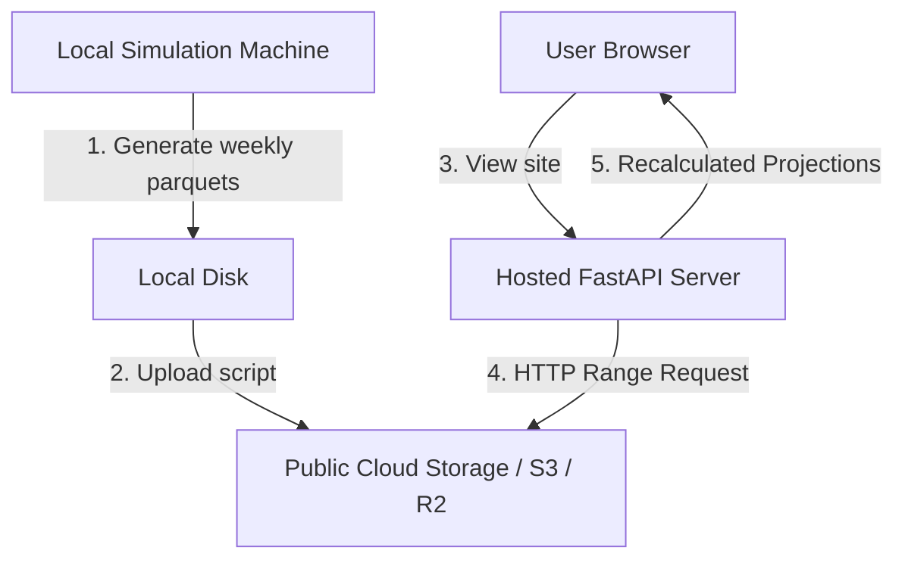

# 🌐 Serverless Parquet Data Lake Architecture

This document outlines the proposed production-ready, low-cost architecture for hosting and querying weekly NFL DFS simulation files on a public website.

---

## 🏗️ Core Architecture Overview

To minimize hosting costs (particularly RAM) and eliminate the need for running a continuous SQL database server, the platform can utilize a **Serverless Columnar Data Lake** powered by **DuckDB** querying remote **Parquet files**.

### 1. Storage Layer
- Weekly simulation results (10,000 iterations per player/game) are saved as `.parquet` files.
- The files are uploaded to a public cloud storage bucket (e.g. AWS S3, Cloudflare R2, or GitHub Releases).
- Files are organized hierarchically: `2025/week_1_players.parquet` (~59MB).

### 2. Query Engine (DuckDB)
- The hosted FastAPI backend uses **DuckDB** to execute analytical queries directly against the remote Parquet URL.
- **HTTP Range Requests:** DuckDB natively reads Parquet file metadata and fetches *only* the specific columns/rows requested for a game via selective range headers.
- **Memory Efficiency:** Instead of loading a 1GB database or 59MB file into the server's RAM, the server only loads the queried data slice (e.g. ~2MB per game).

---

## ⚡ Game-Day Workflow (90-Min Quick Turnaround)

Because Sunday morning breaking news (injury status, snap-share adjustments) requires instant updates, the setup supports **zero-simulation recalculation**:

1. **Baseline Load:** The frontend loads the pre-computed Saturday simulation from the public cloud bucket.
2. **Dynamic Overlays:** If news breaks 90 minutes before kickoff, you or your friends can adjust playbook pace or player workload sliders directly on the site.
3. **Instant Recalculation:** The FastAPI backend applies the **Pace Multipliers** and **Touchdown Redistribution** formulas algebraically to the averages in `<10ms` and updates the DFS optimizer immediately. No new 10,000-run simulation is required.

---

## ☁️ Public Cloud Storage Free Tiers

Below is a comparison of public storage services that can be used for hosting the Parquet files completely free:

| Service | Free Tier Details | Key Advantages |
| :--- | :--- | :--- |
| **Cloudflare R2** | **10 GB storage / month** 10M Read (Class B) operations/month **Zero egress (bandwidth) fees** | **Recommended.** Best overall performance, completely free for this scale, and no bandwidth costs. |
| **GitHub Releases** | **100% Free** (up to 2GB per file) | Infinite bandwidth and storage for public repositories. Ideal for hosting weekly static files. |
| **Backblaze B2** | **10 GB storage / month** | Free egress when routed through Cloudflare's CDN. Easy API integration. |
| **Supabase Storage** | **1 GB storage / month** 5 GB egress/month | Built on top of AWS S3 with a simple UI and API, good for smaller project scopes. |
| **Amazon S3** | **5 GB storage / month** (Expires after 12 months) | Industry standard, but has bandwidth egress fees and the free tier expires. |
