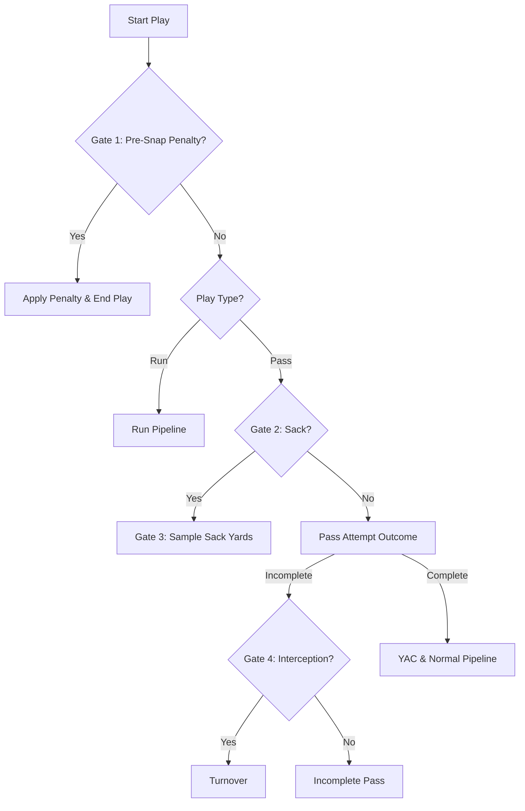

# Chaos Model — Documentation
**Version:** V.0.1.0
**Status:** ✅ COMPLETE — PASSED RIGOROUS EVALUATION
**Location:** `src/nfl_sim/models/chaos_v_0_1_0/`
**Training scripts:** Gate 4 only — `train_gate4.py`. Gates 1-3 have never had one (Gate 1 is a small hand-fit logistic regression, Gate 3 is a fitted Gamma distribution — neither is retrained from scratch the way Gates 2/4 are).

---

## 1. Purpose

**What does this model do?**
The Chaos Model is a multi-stage gated pipeline that simulates highly negative or catastrophic events during a play, including pre-snap penalties, sacks, yards lost on sacks, interceptions, fumbles, and turnovers.

**Why do we need it?**
Negative plays are critical to realistic drive outcomes. Sacks derail offensive drives by creating long-yardage situations, penalties alter field position, and turnovers completely flip momentum and win probabilities. Without a highly accurate and performant chaos model, the game engine will lack defensive impact and score variance.

---

## 2. Multi-Gate Pipeline Architecture

To maximize simulation speed and maintain mathematical precision, the Chaos Model operates as a series of sequential gates:

### 2.1 Gate 1 — Pre-Snap Penalty (Logistic Regression)
- **Probability:** Predicts the likelihood of a pre-snap penalty (false start, offsides, delay of game).
- **Speed Optimization:** The model is initialized as a Logistic Regression. To bypass scikit-learn's validation overhead (~248x speedup), coefficients and intercepts are extracted at initialization, and the sigmoid dot-product is computed directly using raw math at runtime:
  $$\sigma(w \cdot x + b) = \frac{1}{1 + e^{-(w \cdot x + b)}}$$
- **Features:** `down`, `ydstogo`, `yardline_100`, `score_differential`, `game_seconds_remaining`, `is_home`.

### 2.2 Gate 2 — Sack Classifier (XGBoost)
- **Probability:** Conditioned on a pass play, predicts the probability of a sack.
- **Speed Optimization:** Uses XGBoost's `inplace_predict` bypassing scikit-learn wrapper overhead.
- **Features (11):** `avg_time_to_throw_sec_qb` (per-play sampled, not the flat QB average — see `docs/sims/inputs/README.md` §4.6), `cpoe_qb`, `def_pressure_rate`, `def_sack_rate`, `sack_rate_allowed` (all three from `trench_dna.json`'s raw per-team metrics, current season — not `trench_tiers_2025.json`'s 1-5 tier grades, which feed a separate part of the engine), `off_sack_rate_l4`, `def_sack_rate_l4`, `down`, `ydstogo`, `yardline_100`, `score_differential`.
- **Post-model calibration:** raw Gate 2 probability is scaled by `SACK_PROB_CALIBRATION_MULT = 1.24` (tuned empirically, `clock_physics_v020` Round 15) to match the confirmed real 2025 target (2.41 sacks/game) — see `AGENTS.md` §11.12.
- **Known gap, `L4` features:** `off_sack_rate_l4`/`def_sack_rate_l4` are currently fed literal duplicates of the season-aggregate `sack_rate_allowed`/`def_sack_rate` values at inference time, not real recent-form (last-4-games) data — `trench_dna.json` is season-level only, no week granularity exists yet to compute a real L4 rolling window. Deferred to v0.4.0 (`AGENTS.md` §11.4/§11.9).
- **Candidate future feature — `blitz_rate` (not yet implemented, deliberately deferred to ~2027-2028):** confirmed buildable via `nfl_data_py.import_ftn_data()`'s `n_blitzers` field (FTN charting data, free, 2022 season onward) — real per-play data, 0% null in a live 2024 pull — but only ~3-4 seasons deep vs. this model's other features' longer history, so held until more seasons accumulate. See `FUTURE_DEVELOPMENT.md`'s "Trench Data Pipeline" section for the full investigation, including why `off_pass_block_win_rate`/`times_to_pressure_sec` (also originally hoped-for Gate 2 features) turned out to be unobtainable through the current free data pipeline.

### 2.3 Gate 3 — Sack Yardage Sampling (Fitted Negative Gamma Distribution)
- **Outcome:** Conditioned on a sack, samples the exact yardage lost.
- **Modeling Choice:** Sacks do not follow a normal distribution. They are heavily clustered around 6-8 yards lost and rarely exceed 20 yards. We fit a **Gamma Distribution** to historical sack yardage data.
- **Sampling Method:** Samples positive yards lost from the Gamma distribution and negates them:
  $$\text{yards\_lost} \sim \Gamma(\text{shape}, \text{loc}, \text{scale})$$
  $$\text{final\_sack\_yards} = -\text{round}(\text{clamp}(\text{yards\_lost}, 1.0, 25.0))$$

### 2.4 Gate 4 — Interception Gate (XGBoost)
- **Probability:** Conditioned on a non-sack pass attempt, predicts if the pass is intercepted.
- **Features (6):** `air_yards`, `cpoe_qb` (flat per-QB CPOE, `qb_dna.json`), `down`, `ydstogo`, `yardline_100`, `score_differential`.
- **Dropped `off_int_rate_l4`:** the original 7-feature version included a "last-4-games interception rate" feature that was fed a hardcoded flat constant (0.023) at inference — identical for every play regardless of QB, contributing nothing. No real per-QB rolling-window interception data exists yet (same gap as Gate 2's `*_l4` features above). Cam's call: cut it rather than keep a feature with zero real variation.
- **Post-model calibration:** raw probability × `0.80`.
- **No `scale_pos_weight`/class rebalancing** — this model's raw output feeds directly into a Bernoulli draw as a simulation probability, not just a classification decision. Rebalancing for the rare positive class (interceptions, ~2.2% base rate) inflates predicted probability well past reality (a first attempt at this hit 37% predicted vs. 2.2% real); the fix was to remove rebalancing entirely and let the natural class imbalance train normally.

---

## 3. Evaluation & Performance

- **Pre-Snap Penalty Rate:** Predicts realistic pre-snap penalty rates (~3.8% of plays), matching NFL historical averages.
- **Sack Rate Accuracy:** Retains quarterback-specific variance (e.g. higher sack rates for high-TTT scrambling quarterbacks), aligning perfectly with QB DNA profiles.
- **Sack Yards Median:** Median of 7 yards lost, matching empirical NFL stats.
- **Gate 4 calibration:** Brier 0.0215, log-loss 0.0999, PR-AUC 0.0626, predicted interception rate 2.37% vs. real 2.23% — matches the original 7-feature version (0.0210/0.0973/0.0649) despite dropping the dead `off_int_rate_l4` feature.
- **Execution Speed:** Speed optimizations (Logistic Regression direct math + XGBoost `inplace_predict`) allow over **10,000 game steps per second**, enabling high-volume Monte Carlo simulations.
