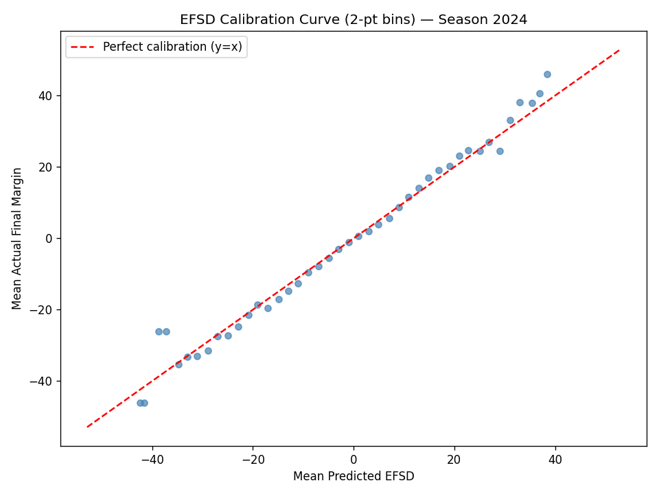
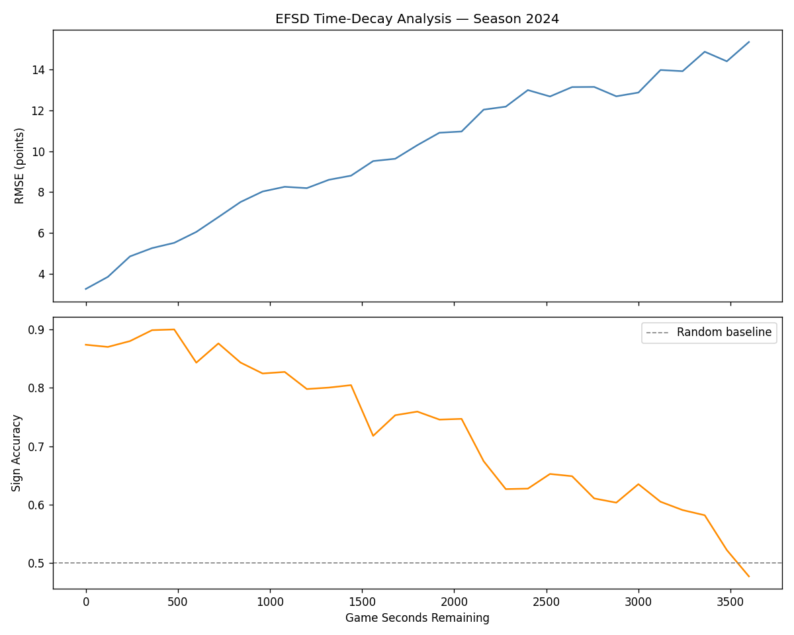
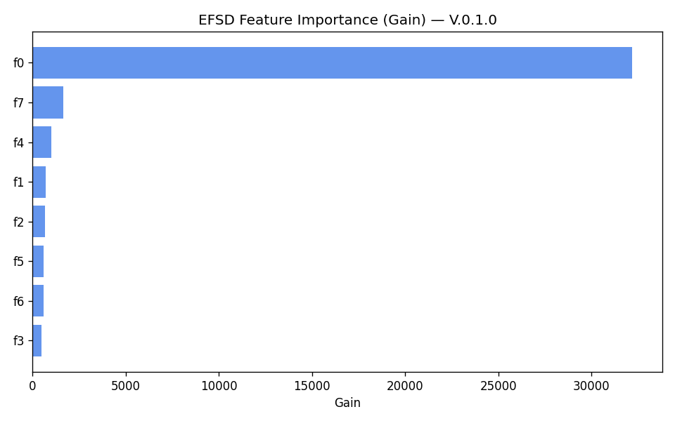
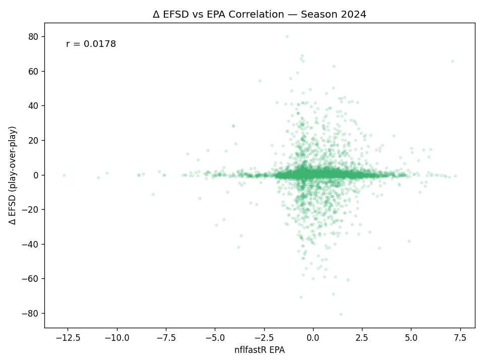

# Expected Final Score Differential (EFSD) Model — Documentation
**Version:** V.0.1.0
**Status:** ✅ COMPLETE — PASSED VALIDATION — NOT USED IN THE LIVE SIMULATION (evaluator-only, by design)
**Location:** `src/nfl_sim/models/efsd_v_0_1_0/`

---

## 1. Purpose

**What does this model do?**
At any point in a game, predict the expected final score margin — `final_posteam_score − final_defteam_score` — from the perspective of the possession team (posteam).

**Why do we need it?**
The existing KEP metric inverts the WP curve to produce a points-scale number, but it inherits WP's bounded range (roughly ±24). EFSD is a **direct regression** on the final margin, which means:
1. It is **unbounded** — correctly predicts large margins in blowouts without capping at ±24.
2. It converges to the **actual final score** as time runs out, providing a natural sanity check.
3. Its predictions **shrink toward zero early** (regression to mean when the outcome is still uncertain) and grow more confident late — the correct behavior for a margin prediction.

**Scope:** EFSD is an evaluator-only metric. It powers the Positional Evaluator's line suggestion tool and the historical timeline chart. It is NOT wired into the play-by-play simulation engine.

---

## 2. Model Architecture

| Property | Value |
|:---|:---|
| Model type | XGBoost Regressor |
| Objective | `reg:squarederror` |
| Tree method | `hist` (histogram-based) |
| Max depth | 6 |
| Learning rate | 0.05 |
| Max estimators | 500 |
| Early stopping | 50 rounds |
| Training data | `nfl_data_py` PBP, 2020–2023 seasons, all play types |
| Test data | 2024 season |
| Saved artifact | `efsd_model.json` (XGBoost booster format) |

The model is wrapped by `EFSDModelV010` in `efsd_inference.py`, which exposes:
- `predict_efsd(game_state)` — scalar, accepts a dict or numpy array
- `predict_batch(X)` — vectorized via `booster.inplace_predict(X)`, returns numpy array

---

## 3. Features

| Feature | Description |
|:---|:---|
| `score_differential` | Posteam score minus defteam score at time of prediction |
| `game_seconds_remaining` | Seconds left in regulation (OT plays set to 1800) |
| `down` | Current down (1–4) |
| `ydstogo` | Yards needed for first down |
| `yardline_100` | Yards from the opponent's goal line |
| `posteam_timeouts_remaining` | Timeouts remaining for the possession team |
| `defteam_timeouts_remaining` | Timeouts remaining for the defensive team |
| `receive_2h_ko` | Whether posteam receives the second-half kickoff; 0.5 for OT plays |

**Target:** `home_score − away_score` (final game margin) converted to posteam-reference using possession team identity.

---

## 4. Evaluation Results

All metrics computed on held-out 2024 season data.

### 4.1 Overall Performance

| Metric | Value |
|:---|:---|
| Test RMSE | 10.11 pts |
| Test MAE | 7.53 pts |
| Test R² | 0.498 |
| Sign accuracy | 74.9% (correctly predicts winner) |
| EPA correlation | 0.018 |

### 4.2 Time-Bucket Performance (key finding)

R² rises sharply as the game clock approaches zero — the correct behavior for a margin predictor.

| Quarter | RMSE | R² | Sign Accuracy |
|:---|:---|:---|:---|
| Q1 (2700–3600 s remaining) | 13.73 | 0.115 | 59.4% |
| Q2 (1800–2699 s remaining) | 11.55 | 0.382 | 70.4% |
| Q3 (900–1799 s remaining) | 8.67 | 0.664 | 79.5% |
| Q4 (0–899 s remaining) | 5.24 | 0.826 | 87.4% |

**Interpretation:** Q1 R² = 0.115 is *not a deficiency* — the model is correctly expressing uncertainty by predicting margins closer to zero than the eventual outcome. A model that was highly confident in Q1 would be poorly calibrated. As time shrinks, the model gains information and its confidence grows.

### 4.3 EPA Correlation

The Pearson correlation between `Δ EFSD` across plays and `EPA` is 0.018 — effectively uncorrelated at play granularity. This is **expected**: EPA measures the immediate situational value of a single play, while EFSD measures the full-game margin horizon. They diverge on individual plays (a punt can have negative EPA but improve EFSD if it pins the opponent deep). They converge directionally over long play sequences.

---

## 5. Key Behavioral Findings

### 5.1 Asymmetric Predictions (Leading vs. Trailing Teams)

EFSD predictions are intentionally **asymmetric** across equal score differentials:
- A team up 7 predicts EFSD ≈ +11 (can grow the margin by playing conservatively)
- A team down 7 predicts EFSD ≈ −4 (must take risks to come back, reducing expected margin)

This is emergent from the training data — trailing teams historically take more risks (going for it on fourth down, passing deep, reducing clock management) which increases variance and therefore pulls the expected margin toward zero relative to a conservative leading team.

### 5.2 Possession-Flip Sign Convention

When computing EFSD for the state *after* a drive end (non-terminal), the possession flips to the opponent. The correct sign convention is: multiply the opponent's raw EFSD prediction by −1, because a positive EFSD for the new possession team is bad for the original team.

```
# In nfl_positional_evaluator.py
efsd_lane[non_terminal] = -efsd_model.predict_batch(X_opp)
```

Terminal plays (score or end of game) return the exact final margin directly, bypassing the model.

---

## 6. Diagnostic Plots

All plots saved to `src/nfl_sim/models/efsd_v_0_1_0/`. Archived copies in `docs/eda_outputs/efsd_v010/`.

| File | What it shows |
|:---|:---|
| `efsd_calibration.png` | Predicted EFSD vs actual final margin; perfect prediction = diagonal |
| `efsd_time_decay.png` | R² and RMSE by quarter — the convergence pattern |
| `efsd_feature_importance.png` | XGBoost feature gain scores |
| `efsd_epa_correlation.png` | Scatter of Δ EFSD vs EPA per play (low correlation expected) |






---

## 7. Integration Points

| Layer | How EFSD is used |
|:---|:---|
| `nfl_positional_evaluator.py` | `evaluate()` and `evaluate_one_step()` compute `efsd_start`, per-concept `mean_efsd`, `delta_efsd` |
| `suggest_lines()` | `metric="efsd"` uses `delta_efsd` / `efsd_steps` to rank and return suggested play sequences |
| `week1_2025.py` | Computes `efsd_off` and `home_efsd` per play for the Historical Testing Lab timeline |
| `src/api/app.py` | `/api/historical/suggest-lines?metric=efsd` passes the metric param through to `suggest_lines()` |
| `frontend_analysis/.../HistoricalLab.jsx` | Renders the EFSD timeline chart (purple, unbounded y-axis) and metric toggle |
