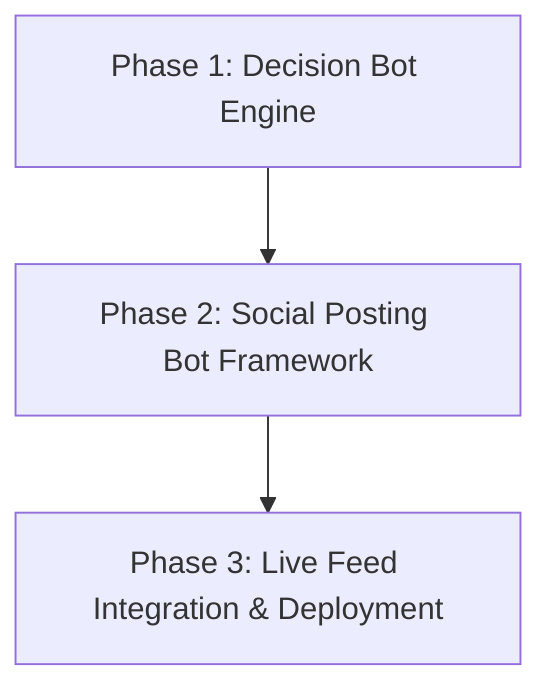

# 🗺️ Sub-Project 2: Fourth Down Decision Bot Roadmap

This document outlines the sequential phases and design specifications for building the **Expected Value (EV) Fourth Down Decision Bot** and its accompanying **Automatic Social Media Posting Bot**.

---

## 🎯 Goal
Develop an analytics engine that:
1. Calculates the mathematically optimal decision (Go, Kick, or Punt) in real-time for any NFL game situation.
2. Integrates coach/team aggression traits.
3. Automatically posts play call decisions, win probability leverage, and expected value recommendations to social platforms (Twitter/X, Mastodon, Bluesky).

---

## 🔄 Sequence of Phases



### 1. Phase 1: Expected Value (EV) Decision Engine
We will build the core decision logic that evaluates the win probability (WP) outcomes of all three actions:

*   **Go-For-It Expected Value ($EV_{Go}$):**
    $$EV_{Go} = P(\text{Convert}) \times WP_{\text{Success}} + (1 - P(\text{Convert})) \times WP_{\text{Failure}}$$
    *   *Where:*
        *   $P(\text{Convert})$ is predicted by `fd_conversion_model.rds` via `R/models/fourth_down/predict_fd.R`.
        *   $WP_{\text{Success}}$ is evaluated using `wp_model.rds` at the expected first-down mark.
        *   $WP_{\text{Failure}}$ is evaluated at the turnover spot.
*   **Field Goal Expected Value ($EV_{FG}$):**
    $$EV_{FG} = P(\text{FG Success}) \times WP_{\text{Made FG}} + (1 - P(\text{FG Success})) \times WP_{\text{Missed FG}}$$
    *   *Where:*
        *   $P(\text{FG Success})$ is predicted by `fg_model.rds` based on distance and kicker skill.
        *   $WP_{\text{Made FG}}$ and $WP_{\text{Missed FG}}$ are evaluated at their respective outcomes.
*   **Punt Expected Value ($EV_{Punt}$):**
    $$EV_{Punt} = WP_{\text{Punted Spot}}$$
    *   *Where the expected net punt distance and return yards determine the field position, evaluated using the win probability model.*

#### 🛠️ Tasks:
- [x] Create `R/simulators/fourth_down/fourth_down_decision.R`.
- [x] Integrate `predict_fd_conversion`, `predict_fg`, and `predict_wp` models into the decision engine.
- [x] Apply **No-Punt / No-FG Zones** (configure thresholds to align decision logic with aggressive head coaches or the 2024 aggressive meta).
- [x] Verify decision boundaries using historical game data.

---

### 2. Phase 2: Automatic Social Media Posting Bot
The social media bot will format fourth-down decision analysis into engaging posts and automatically publish/mock-publish them.

#### 📝 Sample Post Format:
```text
4th & 2 at Opp 45 | DET 20 vs GB 21 | Q4 2:15 (DET ball)
Model Recommendation: GO (WP 54%)
All Scenarios: FG 39%  GO 54%  PUNT 50%
#nfl #4thDown #analytics
```

#### 🛠️ Tasks:
- [x] Design and implement the **Social Bot Post Formatter** and **Posting Policy** (`R/bots/posting_policy.R`):
    - Format situative data (down, distance, time, score).
    - Apply cooldown blocks, blowout blocks, and obvious situation suppressors.
    - Format and output hashtags.
- [x] Build API clients wrapper (`R/bots/post_targets.R`) supporting:
    - **Mastodon API** (via `rtoot` package).
    - **Bluesky API** (via `atrrr` package).
    - Ensure a dry-run local logging mode (`DRY_RUN=1`) exists for offline testing.
- [x] Write integration/smoke test cases to verify posting outputs.

---

### 3. Phase 3: Live Feed Integration & Scheduler
To post automatically during games, we need to poll live play-by-play feeds or hook the engine into live game feeds.

#### 🛠️ Tasks:
- [x] Implement an automated polling scheduler loop (`R/bots/run_live_loop.R` and `R/bots/run_live_today.R`).
- [x] Wire the bot into simulated games or live ESPN scoreboard feeds (`R/live/espn_adapter.R` and `R/bots/fetch_live_plays_espn.R`).
- [ ] Implement automatic posting to Twitter/X (currently pending API credentials).

---

## 📈 Next Session Kick-Off Plan
1. **Twitter/X Integration**: Investigate Twitter/X API access and credentials, and write client helper classes to complement Mastodon and Bluesky.
2. **Review Cooldown & Rate Limits**: Review sqlite log storage entries from past weeks to audit decision logic margins, frequency of post suppression, and post cooldown thresholds.
3. **Advanced Coverage and Scheme Integration**: Incorporate advanced coach defensive tendencies and personnel groupings into the models to refine live conversion expectations.
