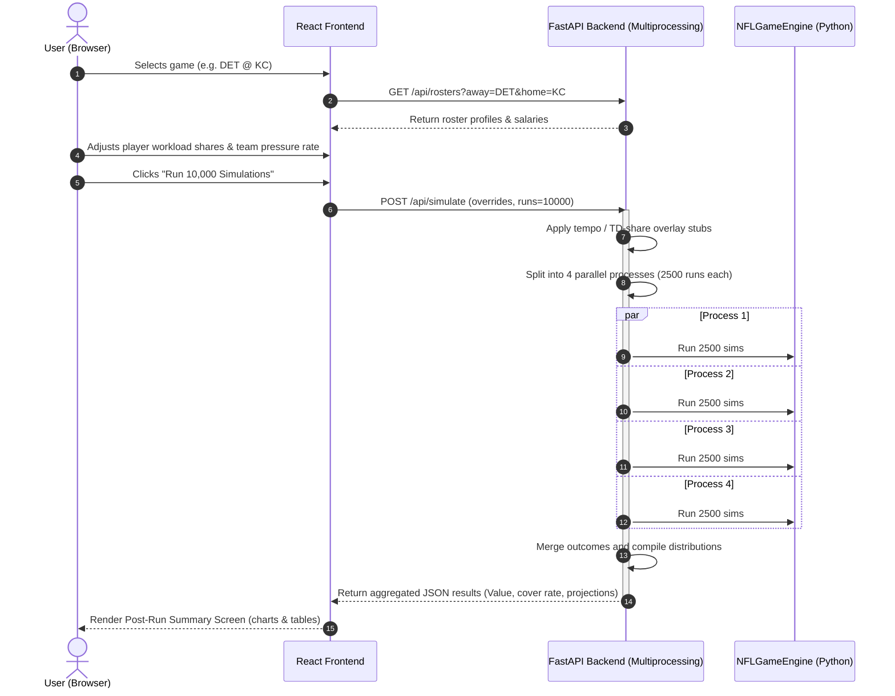

# 🏈 NFLSims: Week-to-Week Simulator User Interface Specification

This specification outlines the architecture, layout, data flows, and configuration parameters for the NFLSims Week-to-Week Simulator interface. 

**Tracer Scope:** Week 1 of the 2025 NFL Season.

---

## 🎯 1. User Interface Layout & Features

The interface is designed as a desktop-first, highly responsive dashboard with a dark, premium aesthetic (utilizing neon accents, glassmorphism, and modern typography).

```
+---------------------------------------------------------------------------------------------------+
|  NFLSIMS DASHBOARD                                              [ Slate Toggle: DK Main | FD Main | Full ]  |
+---------------------------------------------------------------------------------------------------+
|  [ BUF @ KC ]   [ SF @ SEA ]   [ PHI @ DAL ]   [ DET @ GB ]   [ BAL @ PIT ]   [ MIA @ NYJ ]   ...  |
|  Spread: KC -3.5  Spread: SF -1.5  Spread: PHI -4.5 Spread: DET -2.5 Spread: BAL -3.0 Spread: MIA -1.0 |
|  Total:  48.5   Total:  45.0   Total:  49.0    Total:  51.5   Total:  42.5    Total:  46.0         |
+---------------------------------------------------------------------------------------------------+
|                                                                                                   |
|  +---------------------------------------------+   +-------------------------------------------+  |
|  |  🛡️ TEAM OVERRIDES & VEGAS LINES (BUF @ KC)   |   |  🏃 ROSTER & WORKLOAD SETTINGS (BUF)      |  |
|  |                                             |   |                                           |  |
|  |  Spread / Line:  [ BUF +3.5 ] [ KC -3.5 ]   |   |  Filter: [ QB ] [ RB ] [ WR/TE ]          |  |
|  |  Plays Per Game: Away: [ 63.5 ] Home: [ 64.2 ] |   |                                           |  |
|  |                                             |   |  J.Allen (QB)           Salary: $8,200    |  |
|  |  AWAY TRENCHES          HOME TRENCHES       |   |  Rushing Share: [--o-------] 20.9%        |  |
|  |  Pass Pressure Rate     Pass Pressure Rate  |   |  Target Share:  [o---------] 0.0%         |  |
|  |  Allowed: [ 32.5% ]     Allowed: [ 28.1% ]  |   |                                           |  |
|  |                                             |   |  J.Cook (RB)            Salary: $6,500    |  |
|  |  Coach Play Call Tendencies:                |   |  Rushing Share: [----o-----] 44.9%        |  |
|  |  PROE (Pass Rate Over Expected):            |   |  Target Share:  [--o-------] 7.1%         |  |
|  |  Away: [------o---] +5%   Home: [--o-------] -2%|   |  Catch Rate:    [------o---] 78.4%        |  |
|  |  Deep Shot Rate:                            |   |  TD Share:      [---o------] 18.0%        |  |
|  |  Away: [--o-------] 12%   Home: [----o-----] 15%|   |                                           |  |
|  +---------------------------------------------+   +-------------------------------------------+  |
|                                                                                                   |
|  +---------------------------------------------------------------------------------------------+  |
|  |  🎮 SIMULATION RUNNER                                                                        |  |
|  |  Number of Runs: [ 10000 ] (Targeting Multiprocessing Sub-60s)  | [ RUN MONTE CARLO ]        |  |
|  +---------------------------------------------------------------------------------------------+  |
|                                                                                                   |
|  +---------------------------------------------------------------------------------------------+  |
|  |  🏆 POST-RUN SUMMARY SCREEN                                                                   |  |
|  |                                                                                             |  |
|  |  Sim Projected Score: BUF 24.2 - KC 23.8       Win Probability: BUF 51.4% - KC 48.6%        |  |
|  |  Sim Cover Rate:      BUF +3.5 (55.4%)         Over/Under Rate: Over 48.5 (52.1%)           |  |
|  |                                                             |
|  |  Adjusted Player Projections & DFS Value:                                                   |  |
|  |  Player      Pos  Salary  Proj Pts  Pts/$K Value  Att/Rec  Yds    TDs   Fumbles             |  |
|  |  J.Allen     QB   $8,200  24.5      2.99          32.4     245.5  1.8   0.1                 |  |
|  |  J.Cook      RB   $6,500  14.1      2.17          14.2     66.8   0.6   0.2                 |  |
|  +---------------------------------------------------------------------------------------------+  |
+---------------------------------------------------------------------------------------------------+
```

### A. Week Schedule Bar (Top Header)
* **Goal**: Select games and filter them based on DFS slates for the **2025** season schedule.
* **Slate Toggles**:
  * `Full Week`: Displays all games (Week 1 of 2025).
  * `DraftKings Main Slate`: Filters out non-main slate games (e.g., TNF, SNF, MNF).
  * `FanDuel Main Slate`: Filters games according to FanDuel contest configurations.
* **Game Cards**: Each card displays the matchup, sports book spread, total line, and selected highlight border.

### B. Team Overrides (Left Panel)
Enables the user to modify team-level simulation environment parameters:
* **Spread / Line**: Adjust the Vegas line or handicap for the game, altering win probability and decision adjustments.
* **Pressure Rate**: Overrides offensive pressure allowed rate or defensive pressure generated rate (directly impacts sack rates and time-to-throw distributions).
* **Plays Per Game (Tempo Override)**:
  * Overrides the average offensive plays run per game, controlling game tempo and total play volume.
  * *Tracer Implementation*: Since this is not fully integrated into the simulation game loop clock logic yet, the backend API will intercept this override and scale the overall simulation volume linearly to simulate the tempo difference.
* **Coach DNA Sliders**: `PROE`, `Deep Shot Rate`, and `Conservative Score Bias`.

### C. Roster & Player Workload Settings (Right Panel)
Allows adjusting workloads, efficiency metrics, and showing DFS data:
* **DFS Salary**: Display DraftKings or FanDuel salary next to each player.
* **Adjustable Workload Shares**:
  * **Rushing Share**: The percentage of the team's rushing attempts allocated to this player.
  * **Target Share**: The percentage of the team's passing attempts targeted to this player.
  * **TD Share (Touchdown Allocation Override)**:
    * The percentage of team touchdowns allocated to this player.
    * *Tracer Implementation*: Since TD selection is currently derived from individual play outcomes (e.g., YAC or rush completion points), the backend API will apply an post-play TD allocation adjustment factor scaling final scoring probability to verify the user-adjustability pipeline.
  * **Catch Rate**: The raw catching success rate (directly overrides target-depth calculation logic to verify the workload adjustment loop).

### D. Post-Run Summary Screen (Bottom Panel)
Appears automatically once the simulation run completes.
* **Simulated Metrics vs. Vegas Line**: Displays Cover Rate, Over/Under coverage, Win Probability, and average scores.
* **Interactive Projections Table**:
  * Lists players with their DFS Salary.
  * Shows **Projected Points** (DK/FD scoring).
  * Calculates **Value (Points per $1,000 of salary)**.
  * Displays volume stats: carries/receptions, yards, projected touchdowns, and fumbles.

---

## 🛠️ 2. Technical Stack & Data Storage

To maintain zero cost, ease of setup, and high mathematical performance:

### A. Data Ingestion: Flat Files & SQLite
* We will use **flat JSON and CSV files** to store Week 1 DFS salaries and slate metadata (e.g., `data/fd/` and `data/schedule_2025.json`).
* Flat files are free, stored in git version control, and can be read into python memory maps on API startup in under 5 milliseconds.
* If the project scales to multiple seasons, weeks, and complex historical queries, we will transition to **SQLite**, a serverless, single-file relational database engine included by default in Python's standard library. SQLite requires zero server hosting, zero installation cost, and maintains high read performance.

### B. Parallelized Simulations
* The backend will utilize Python's `ProcessPoolExecutor` (from `concurrent.futures`) to run batches of simulations concurrently across available CPU cores, targeting a total run time of under 60 seconds for 10,000 simulations.

---

## 🔄 3. Simulation Request/Response Data Flow


