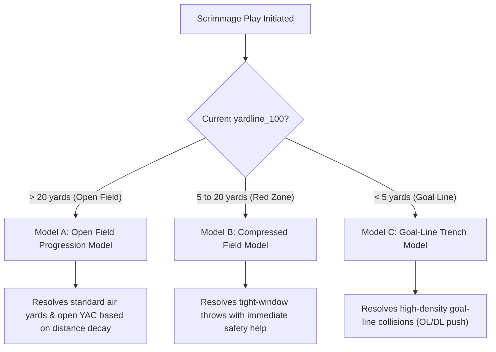

# 📋 NFLSims V.0.2.0 Model & Calibration Implementation Plan

This document outlines the architectural specifications, calibration updates, and structural audits scheduled for the **V.0.2.0** engine release. These updates address critical deficiencies discovered in previous models, establish high-fidelity roster validation rules, and optimize the underlying simulation codebase.

---

## 🗺️ 1. Multi-Zone Spatial Play Architecture

To resolve the **Yard-to-Point Conversion Paradox** and restore empirical touchdown efficiency, we will segment scrimmage play execution into a **three-zone spatial architecture** based on the current field position (`yardline_100`):



* **Model A: Open Field Progression (`yardline_100 > 20`)**: Standard route spacing, vertical air yards decay, and open-field run-blocking tiers.
* **Model B: Compressed Space (`5 < yardline_100 <= 20`)**: High defender density and tight coverage. Completion rates incorporate contested catch profiles and WR/TE physical height.
* **Model C: Goal Line (`yardline_100 <= 5`)**: Scrimmage front push modeling. Rushing success is determined by a **Trench Push coefficient** (Offensive Line run-blocking tier vs. Defensive Line run-stuff tier) rather than speed.

---

## 🦾 2. Re-Engineered Specialist Decision Bots

The previous specialist decision models are outdated and underperforming. We will scrap the existing implementations and train brand-new, premium bots to handle fourth downs and kicking:

### 🎯 A. The Fourth-Down Coach Decision Bot
* **Objective**: Replace the baseline model with a high-fidelity, situational coach decision engine.
* **Inputs**: Field position (`yardline_100`), distance-to-go, time remaining, point differential, timeouts remaining, and the team's custom coach aggression profile.
* **Target Calibration**: The bot will dynamically weigh the expected utility of going for it, kicking, or punting. In opponent territory (e.g., inside the 40-yard line), going for it on 4th-and-short will be calibrated to real-world aggressive coaching standards (~50% go-rate inside the 5-yard line).

### 🥾 B. The Field Goal Success Bot
* **Objective**: Completely replace the outdated logistic regression kicker model.
* **Inputs**: Exact distance (kick length = yardline + 17), kicker historical field-goal percentages, stadium effects (closed dome vs. open wind/temperature), and weather profiles.
* **Target Calibration**: Recreate realistic distance-decay probabilities (e.g., highly reliable from sub-40 yards, tapering down realistic drop-offs beyond 55 yards, with a strict physical drop-off past 65 yards).

---

## 👟 3. Special Teams & Turnovers Return Abstraction

We will transition away from rigid, static special teams returns (e.g., hard-coded 25-yard touchbacks, 7-yard punt returns, and 10-yard turnover returns) toward a dynamic **Return-Evaluation Framework**:
* **Return Probability Engine**: Model the decision to return vs. fair-catch or touchback.
* **Dynamic Returns Note**: We will design a lightweight return-yardage simulator that factors in:
  1. Returner skill rating (from skill DNA).
  2. Defensive coverage speed and tackling ratings.
  3. Spatial field positioning at the catch spot.
  *This will introduce authentic returns, dynamic starting field position variance, and rare big-play touchdown runbacks to scrimmage simulations.*

---

## 🧬 4. Contested Catch Rate & Player DNA Integration

We will enrich the player DNA databases (`skill_dna.json` and active roster traits) to support high-fidelity compressed-zone passing resolutions.

### 📊 Roster Trait Expansion
We will integrate a new contested-catch rate metric:
```json
"A.Brown": {
    "pos": "WR/TE",
    "target_share": 0.201,
    "carry_share": 0.0,
    "adot": 11.2,
    "yac_per_rec": 4.9,
    "catch_rate": 0.715,
    "contested_catch_rate": 0.628
}
```

---

## 📋 5. Codebase Architecture Audit Registry

To ensure high-performance execution and eliminate redundant calculation loops, we will perform a systematic code audit of all core files in the [nfl_sim](file:///c:/Users/txcwa/OneDrive/Desktop/Antigravity%20Projects/NFLSims%20-%20Copy/src/nfl_sim) directory. We will catalog which files are active, obsolete, or candidates for matrix-vectorization optimizations (replacing slow Python loops with high-speed NumPy/Pandas array operations):

| File | Status | Audit Task & Optimization Plan |
| :--- | :---: | :--- |
| [batch.py](file:///c:/Users/txcwa/OneDrive/Desktop/Antigravity%20Projects/NFLSims%20-%20Copy/src/nfl_sim/batch.py) | **Active** | *Audit Required*: Assess `BatchSimulator` and `StatAggregator` routines. Optimize data structures to avoid big-O overhead when aggregating raw player data across hundreds of iterations. |
| [game_engine.py](file:///c:/Users/txcwa/OneDrive/Desktop/Antigravity%20Projects/NFLSims%20-%20Copy/src/nfl_sim/game_engine.py) | **Active** | *Audit Required*: Streamline `_simulate_play_logic()`. Eliminate nested loops, verify that clock runoffs are vectorized where possible, and ensure player stat updates rely on direct memory updates rather than DataFrame appends. |
| [model_registry.py](file:///c:/Users/txcwa/OneDrive/Desktop/Antigravity%20Projects/NFLSims%20-%20Copy/src/nfl_sim/model_registry.py) | **Active** | *Audit Required*: Verify that XGBoost and scikit-learn models are strictly loaded **once** in global cache to ensure zero redundant disk loads. |
| [proe_overlay_v_0_1_0.py](file:///c:/Users/txcwa/OneDrive/Desktop/Antigravity%20Projects/NFLSims%20-%20Copy/src/nfl_sim/proe_overlay_v_0_1_0.py) | **Active** | *Audit Required*: Verify that Pass-Rate-Over-Expected overlays fit cleanly within the new multi-zone play selection logic. |
| [scoring.py](file:///c:/Users/txcwa/OneDrive/Desktop/Antigravity%20Projects/NFLSims%20-%20Copy/src/nfl_sim/scoring.py) | **Active** | *Audit Required*: Ensure fast vectorized fantasy scoring calculations over large player output lists. |
| [script_chainer.py](file:///c:/Users/txcwa/OneDrive/Desktop/Antigravity%20Projects/NFLSims%20-%20Copy/src/nfl_sim/script_chainer.py) | **Review** | Check if file is still needed for multi-week execution or if it has been made obsolete by `run_weeks_1_to_4.py`. |
| [utils.py](file:///c:/Users/txcwa/OneDrive/Desktop/Antigravity%20Projects/NFLSims%20-%20Copy/src/nfl_sim/utils.py) | **Active** | Streamline JSON load/save operations; cache static dictionaries globally. |
| [visuals.py](file:///c:/Users/txcwa/OneDrive/Desktop/Antigravity%20Projects/NFLSims%20-%20Copy/src/nfl_sim/visuals.py) | **Active** | *Audit Required*: Optimize plotting routines and ensure that diagnostic image generation utilizes fast, vectorized aggregations. |

---

## 📈 6. Formalized EDA & Play-by-Play Debugging Reports

To preserve valuable diagnostic details and protect statistical tracking metrics from being lost, we will **formalize and automate** our Exploratory Data Analysis (EDA) reports for every simulation run:
* **Play Diagnostics CSV/JSON**: Write complete play-by-play diagnostics for a subset of games during runs to allow deep-dive debugging of down-and-distance logic.
* **Automated EDA Output**: Establish a routine that takes weekly CSV outputs (`game_summaries.csv`, `player_summaries.csv`) and generates key distributions:
  1. Snaps per game histogram (ensuring a clean median ~120-126).
  2. Total team offensive yards distribution.
  3. Total punts per game.
  4. Passing air-yards vs. YAC scatterplots.
* **Persistent Visualization Logging**: Automatically archive these diagnostic charts to the `docs/eda_outputs/` directory rather than deleting them, providing a historical log of model changes.

---

## 🛡️ 7. Evergreen Quality-Assurance Checklist

This section represents permanent, ongoing quality-assurance items that must be verified during every development loop and at the start of every simulated year:

### 👥 A. Roster & Year Alignment (Roster Integrity)
* **The Problem**: Cache files or stale databases can cause outdated rosters. In previous runs, QBs like Geno Smith and Sam Darnold were not aligned with their correct 2025 teams.
* **Checklist Rule**: Roster files (`data/current_rosters/*`) must be systematically checked at the start of every season run. Add an automated pre-flight script `validate_rosters.py` that verifies:
  1. Player active statuses and team alignment against current NFL rosters.
  2. Total team target shares sum to approximately `1.0` (100%).
  3. Total team carry shares sum to approximately `1.0` (100%).
  4. Starter depth chart positions are up to date.

### ⏱️ B. Late-Game Clock & Strategy Technique Management
* **The Problem**: End-game rules are delicate and must be continually monitored to prevent bugs like 4th-down clock freezes or victory formation runtime hangs.
* **Checklist Rule**: Monitor time-management logic closely:
  1. Victory formation (kneeling) executes correctly inside 2 minutes and bleeds up to 40 seconds.
  2. Offense spike logic triggers under hurry-up scenarios when out of timeouts.
  3. Defensive and offensive timeout conservation triggers appropriately.

### 🔬 C. Micro-Adjustment Mathematical Validation
* **The Problem**: Small statistical adjustments (e.g. QB Time-To-Throw, CPOE variances, fumble rates) must represent actual historical realities rather than subjective bias.
* **Checklist Rule**: Every micro-adjustment must be systematically validated:
  1. **QB Time-To-Throw (TTT)**: Ensure TTT is extrapolated on every play from a normal distribution based on the QB's actual historical rate (e.g. `np.random.normal(avg_ttt, 0.6)`), rather than a generic static average.
  2. **Interception/Fumble Calibrations**: Ensure fumble and interception rates remain aligned with historical averages, accounting for elite QB reductions or high-impact trenches.
  3. **YAC and Air Yards Distributions**: Verify that YAC and air yards outputs align mathematically with empirical NextGen Stats.
